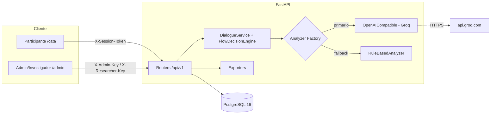
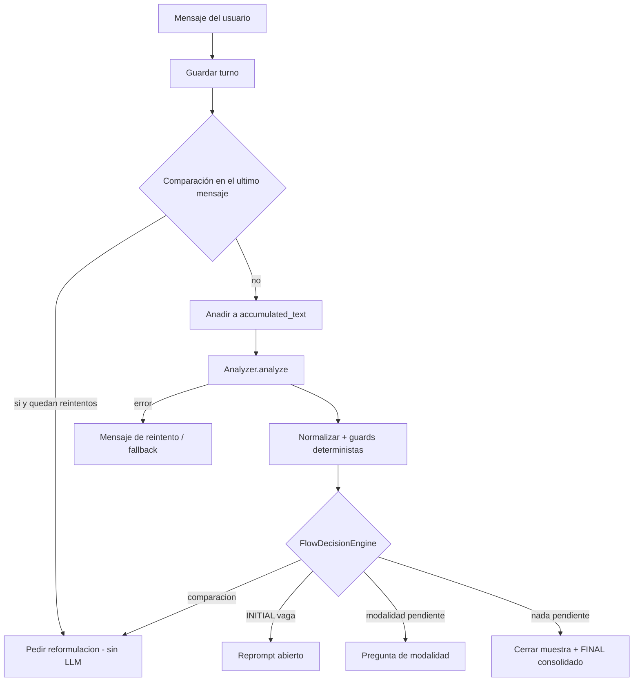

# Arquitectura

## Tipo de arquitectura

Cliente-servidor **monolítico por capas**. Una SPA React de doble rol (participante en
`/cata`, administración en `/admin`) consume una API REST FastAPI. PostgreSQL es el único
almacén de estado. Un LLM externo *stateless* se usa exclusivamente como **extractor de
texto**: no mantiene estado ni decide el flujo.

## Componentes

| Componente | Responsabilidad | Ubicación |
|---|---|---|
| Frontend participante | Máquina de fases del chat, persistencia local, expiración de token | `frontend/src/App.tsx` |
| Frontend admin | Crear/listar/cerrar/borrar sesiones, exportar, healthcheck | `frontend/src/admin/` |
| Routers API | HTTP, validación, autenticación, límites de tasa | `backend/app/api/routes/` |
| DialogueService | Orquesta el turno conversacional | `backend/app/services/dialogue.py` |
| FlowDecisionEngine | Decide la siguiente acción del bot | `backend/app/services/dialogue.py` |
| Analyzer | Extrae evidencia por modalidad | `backend/app/services/analyzer/` |
| Exporters | CSV/JSON/XLSX | `backend/app/services/exporters.py` |
| Persistencia | Modelos SQLAlchemy + Alembic | `backend/app/models/`, `backend/alembic/` |

## Diagrama de arquitectura

## Reparto de responsabilidades

- **Frontend:** navegación entre fases, persistencia de conveniencia
  (`localStorage` para el estado, `sessionStorage` para el token), detección de expiración de
  token y clasificación de errores de API. **No contiene lógica sensorial.**
- **Backend:** flujo conversacional, cálculo determinista de vaguedad y comparación,
  consolidación por modalidad, persistencia de análisis, exportación y seguridad.
- **LLM:** únicamente extracción por modalidad (mención, descriptor, valoración).

## Selección del analizador

`get_analyzer()` (`analyzer/factory.py`):

1. Si `LLM_PROVIDER` es compatible OpenAI (`groq`, `openai`, `openai-compatible`, `ollama`)
   **y** hay `LLM_API_KEY` → `OpenAICompatibleAnalyzer`.
   - Si `LLM_FALLBACK_TO_RULES=true`, se envuelve en `FallbackAnalyzer` con
     `RuleBasedAnalyzer` como respaldo.
2. En cualquier otro caso → `RuleBasedAnalyzer`.

## Motor de decisión (determinista)

`FlowDecisionEngine.apply()` evalúa en orden (`services/dialogue.py`):

1. **Comparación** (solo el último mensaje) → pedir reformulación, sin llamar al LLM.
2. **Respuesta INITIAL vaga** (≤ 2 modalidades completas) → reprompt abierto.
3. **Modalidad pendiente** → pregunta de esa modalidad; hasta `MAX_MODALITY_ATTEMPTS`.
4. **Nada pendiente** → cierre de muestra + análisis FINAL consolidado.

Una modalidad se considera **completa** solo cuando `mention_text`, `descriptor_text` y
`valuation_text` son no vacíos.

## Decisiones técnicas principales

- **El backend es dueño del flujo.** El LLM nunca decide acciones; el backend sobrescribe
  `is_vague` y `has_comparison` y calcula la acción efectiva.
- **El análisis FINAL es una consolidación** de datos ya validados (mejor resultado
  persistido por modalidad), nunca un re-análisis global. Así una modalidad completa no se
  puede blanquear al cerrar la muestra.
- **`accumulated_text` completo se persiste** para trazabilidad; solo se trunca la ventana
  enviada al LLM (`LLM_CONTEXT_MAX_CHARS`).
- **Tokens de sesión hasheados** (SHA-256) con TTL; comparación en tiempo constante.
- **Integridad a nivel DB:** *trigger* que impide superar `total_samples` y FK
  `source_turn_id` con `ON DELETE SET NULL`.

## Riesgos arquitectónicos conocidos

- `dialogue.py` concentra el motor y cinco servicios auxiliares (~1.000 líneas): candidato a
  dividirse en un paquete.
- La llamada al LLM está en la ruta crítica del turno (síncrona); el *fallback* a reglas la
  mitiga.
- `accumulated_text` crece sin límite en base de datos (aceptado por trazabilidad).
