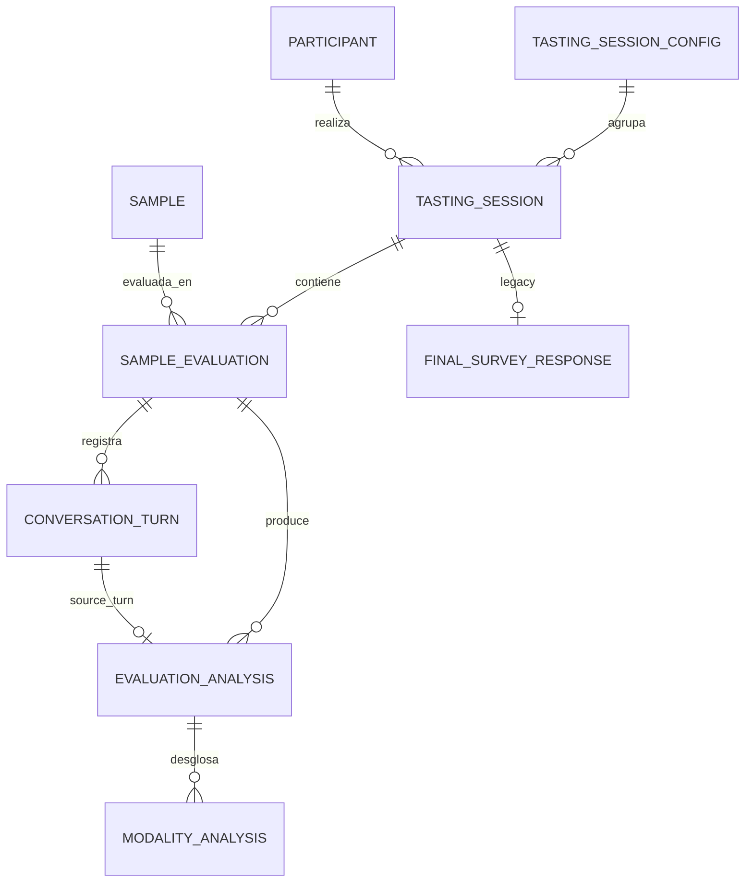

# Modelo de datos

Definido en `backend/app/models/entities.py` y versionado con Alembic
(`backend/alembic/versions/`, revisiones 0001→0008).

## Entidades

| Entidad | Tabla | Descripción |
|---|---|---|
| `TastingSessionConfig` | `tasting_session_configs` | Plantilla de cata creada por el admin. Contiene el `public_token` y los códigos de muestra |
| `Participant` | `participants` | Participante, identificado por `participant_code` único |
| `TastingSession` | `tasting_sessions` | Sesión de un participante contra una configuración de cata |
| `Sample` | `samples` | Muestra, identificada por `sample_code` único (compartida entre sesiones) |
| `SampleEvaluation` | `sample_evaluations` | Evaluación de una muestra dentro de una sesión (estado del flujo) |
| `ConversationTurn` | `conversation_turns` | Cada turno (usuario / bot / sistema) de la conversación |
| `EvaluationAnalysis` | `evaluation_analyses` | Un análisis producido en un turno (INITIAL / INTERMEDIATE / FINAL) |
| `ModalityAnalysis` | `modality_analyses` | Desglose por modalidad de un análisis |
| `FinalSurveyResponse` | `final_survey_responses` | **Legacy**: encuesta global de sesión (solo la puebla el endpoint `survey`) |

## Campos principales

- **TastingSessionConfig:** `public_token` (unique), `title`, `status` (`ACTIVE`/`CLOSED`),
  `sample_codes_json`, `final_redirect_url`.
- **TastingSession:** `participant_id` (FK), `admin_session_id` (FK, nullable),
  `status`, `total_samples`, `current_sample_index`, `session_token_hash`,
  `config_json` (guarda `session_token_expires_at`).
- **SampleEvaluation:** `presentation_order`, `status`, `current_state`, `current_modality`,
  `*_retry_count`, `accumulated_text`, `initial_response_text`, `final_comment`,
  `exhausted_modalities_json`, `modality_attempts_json`.
- **EvaluationAnalysis:** `analysis_scope`, `is_vague`, `has_comparison`,
  `effective_next_action`, `llm_provider/model`, `prompt_version`, `raw_response_json`,
  `source_turn_id` (FK, `ON DELETE SET NULL`).
- **ModalityAnalysis:** `modality`, `mention_text`, `descriptor_text`, `valuation_text`,
  `is_complete`.

## Relaciones

## Restricciones e integridad

- `UniqueConstraint` en `TastingSessionConfig.public_token`, `Participant.participant_code`,
  `Sample.sample_code`, `FinalSurveyResponse.session_id`.
- `SampleEvaluation`: unique `(session_id, sample_id)` y `(session_id, presentation_order)`.
- `ConversationTurn`: unique `(evaluation_id, turn_index)`.
- `ModalityAnalysis`: unique `(analysis_id, modality)`.
- **Borrado en cascada** ORM desde `TastingSessionConfig` hacia sesiones, evaluaciones,
  turnos, análisis y modalidades.
- **Trigger PL/pgSQL** `check_max_evaluations_per_session` (migración 0005): impide insertar
  más evaluaciones que `total_samples`.
- **FK `source_turn_id` con `ON DELETE SET NULL`** (migración 0008): evita el fallo de borrado
  entre tablas hermanas.

## Datos obligatorios vs. opcionales

- Obligatorios: identificadores, `sample_codes_json`, `status`, `total_samples`,
  `accumulated_text` (por defecto `''`), campos de análisis.
- Opcionales / nullable: `title`, `final_redirect_url`, `admin_session_id`,
  `session_token_hash`, `current_modality`, `final_comment`, `source_turn_id`.

## Datos heredados / no usados

- `FinalSurveyResponse` y la tabla `final_survey_responses` solo se pueblan desde el endpoint
  legacy `POST /sessions/{id}/survey`, que el frontend actual no utiliza (el flujo usa el
  comentario por muestra). Candidato a eliminación o a documentar explícitamente su retención.
- Columnas históricas ya eliminadas por migración: `modality_analyses.mentioned_flag` (0004),
  `evaluation_analyses.suggested_next_action` (0002).

## Migraciones

| Revisión | Contenido |
|---|---|
| 0001 | Esquema inicial |
| 0002 | `session_token_hash`, `next_turn_index`; elimina `suggested_next_action` |
| 0003 | `modality_attempts_json` |
| 0004 | Elimina `mentioned_flag` |
| 0005 | Trigger de máximo de evaluaciones por sesión |
| 0006 | `tasting_session_configs`, `admin_session_id`, `final_comment` |
| 0007 | `final_redirect_url` |
| 0008 | FK `source_turn_id` → `ON DELETE SET NULL` |

Aplicar con `alembic upgrade head` (el backend lo hace automáticamente al arrancar en Docker).
